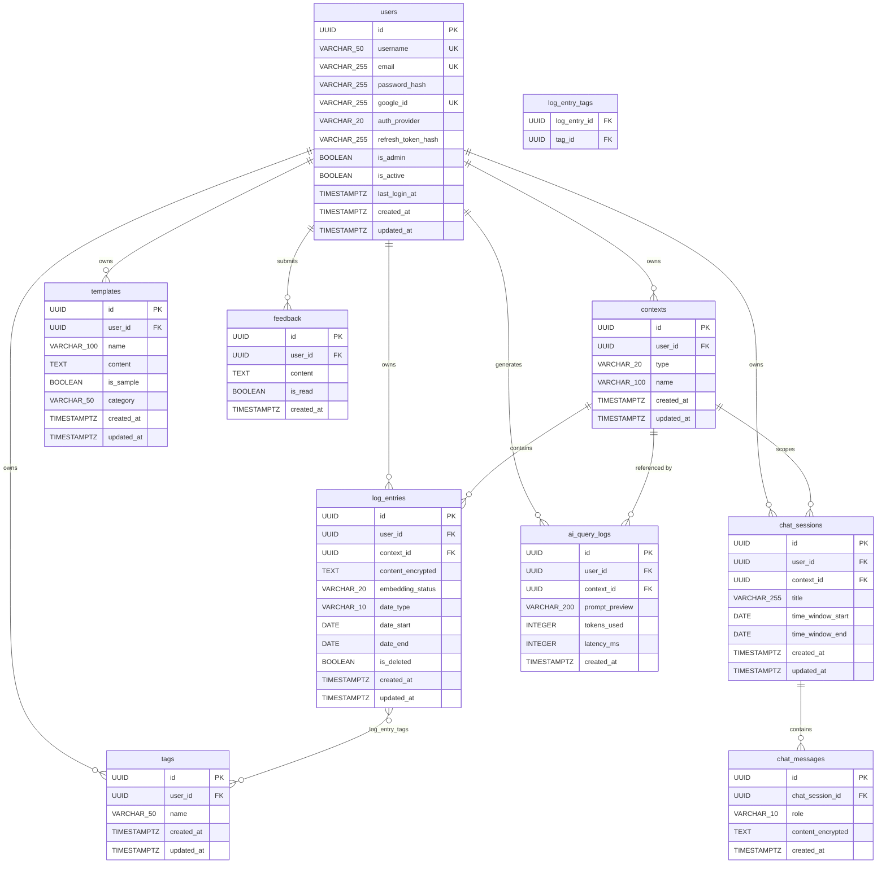

# MyLogMate — Database Design

**Version:** 1.0 | **Date:** May 2026 | **Author:** Vamsi | **Status:** Awaiting Approval

> Step 1 of the implementation plan. This document extends and refines the initial schema in `docs/ARCHITECTURE.md` section 4. All gaps, additions, and justifications are called out explicitly.

---

## 1. Design Decisions & Changes from Initial Schema

The initial schema in ARCHITECTURE.md is solid. The following changes are applied after critical review:

| # | Change | Table | Justification |
|---|--------|-------|---------------|
| 1 | Add `refresh_token_hash VARCHAR(255) NULLABLE` | `users` | Token rotation requires invalidating old refresh tokens. httpOnly cookies alone cannot revoke server-side. Storing the hash of the current valid token (bcrypt or SHA-256) enables single-device invalidation without a separate sessions table. On logout or refresh, this is cleared/rotated. |
| 2 | Add `last_login_at TIMESTAMPTZ NULLABLE` | `users` | Admin dashboard "active users" metric. Needed to answer "users who logged in within last 30 days." Cannot be derived from other tables. |
| 3 | Add `embedding_status VARCHAR(20) DEFAULT 'pending'` | `log_entries` | Tracks whether the Celery embedding task has successfully stored this entry in Qdrant. Values: `pending`, `embedded`, `failed`. Critical for retry logic, health monitoring, and admin debugging. Without this, there is no way to identify un-embedded or failed entries. |
| 4 | Add index on `tag_id` | `log_entry_tags` | Reverse lookup: "all log entries that use a given tag" (needed for tag rename/delete cascades). Without this index, a full scan of the join table is required. |
| 5 | Add `is_read BOOLEAN DEFAULT false` | `feedback` | Admin dashboard shows feedback list. Needs a way to mark feedback as reviewed. Simple UX improvement with zero cost. |
| 6 | Add `latency_ms INTEGER NULLABLE` | `ai_query_logs` | Tracks AI query response time for admin performance monitoring. Groq API latency varies; this helps detect degradation. |
| 7 | Add composite index `(user_id, created_at)` | `ai_query_logs` | Rate limit check is `SELECT COUNT(*) WHERE user_id = ? AND created_at > today`. Without this index, every AI request scans the whole table. |
| 8 | Add composite index `(user_id, created_at)` | `chat_sessions` | Chat history listing is ordered by recency per user. This index makes it O(log n) instead of full scan. |
| 9 | Clarify FK cascade on `contexts` | `log_entries` | When a context is deleted, all its log_entries must also be deleted (PRD requirement). This should be enforced at DB level with `ON DELETE CASCADE`, not just in the service layer, to prevent orphaned rows if the service fails mid-transaction. |
| 10 | `content` encryption in `chat_messages` | `chat_messages` | **Design decision:** Chat messages contain the user's exact questions and AI responses about their work — sensitive personal data. Encrypting at app layer (same AES-256 pattern as log_entries) ensures the privacy guarantee holds. Column renamed to `content_encrypted`. Cost: identical decrypt overhead per message fetch. |

---

## 2. Entity Relationship Diagram



---

## 3. Complete Table Definitions

### 3.1 `users`

```sql
CREATE TABLE users (
    id                  UUID        PRIMARY KEY DEFAULT gen_random_uuid(),
    username            VARCHAR(50) NOT NULL,
    email               VARCHAR(255),
    password_hash       VARCHAR(255),                          -- NULL for Google OAuth users
    google_id           VARCHAR(255),                          -- NULL for local auth users
    auth_provider       VARCHAR(20) NOT NULL DEFAULT 'local',  -- 'local' | 'google'
    refresh_token_hash  VARCHAR(255),                          -- SHA-256 hash of current valid refresh token; NULL = no active session
    is_admin            BOOLEAN     NOT NULL DEFAULT false,
    is_active           BOOLEAN     NOT NULL DEFAULT true,
    last_login_at       TIMESTAMPTZ,
    created_at          TIMESTAMPTZ NOT NULL DEFAULT NOW(),
    updated_at          TIMESTAMPTZ NOT NULL DEFAULT NOW(),

    CONSTRAINT users_username_key UNIQUE (username),
    CONSTRAINT users_email_key UNIQUE (email),
    CONSTRAINT users_google_id_key UNIQUE (google_id),
    CONSTRAINT users_auth_provider_check CHECK (auth_provider IN ('local', 'google'))
);
```

**Indexes:**
```sql
CREATE INDEX idx_users_email ON users (email);           -- password reset lookup
CREATE INDEX idx_users_is_active ON users (is_active);   -- admin active user queries
```

**Notes:**
- `email` is NULLABLE to support Google OAuth users who don't provide email (rare but valid)
- `password_hash` is NULLABLE for Google OAuth users
- `refresh_token_hash` stores SHA-256 of the refresh token JWT — not the token itself. On logout or token rotation, this is set to NULL or updated. One active session per user in v1.
- `auth_provider` determines which auth path to use on login

---

### 3.2 `contexts`

```sql
CREATE TABLE contexts (
    id          UUID        PRIMARY KEY DEFAULT gen_random_uuid(),
    user_id     UUID        NOT NULL REFERENCES users(id) ON DELETE CASCADE,
    type        VARCHAR(20) NOT NULL,   -- 'self' | 'teammate' | 'project'
    name        VARCHAR(100) NOT NULL,
    created_at  TIMESTAMPTZ NOT NULL DEFAULT NOW(),
    updated_at  TIMESTAMPTZ NOT NULL DEFAULT NOW(),

    CONSTRAINT contexts_type_check CHECK (type IN ('self', 'teammate', 'project')),
    CONSTRAINT contexts_user_type_name_key UNIQUE (user_id, type, name)
);
```

**Indexes:**
```sql
CREATE INDEX idx_contexts_user_id ON contexts (user_id);
```

**Notes:**
- `ON DELETE CASCADE` on `user_id` — deleting a user removes all their contexts
- The unique constraint prevents duplicate names per type per user (e.g., two contexts named "Alice" of type "teammate")
- `Self` context is auto-created at signup with `type = 'self'` and `name = 'Self'`; application logic prevents deletion of self-type contexts

---

### 3.3 `log_entries`

```sql
CREATE TABLE log_entries (
    id                  UUID        PRIMARY KEY DEFAULT gen_random_uuid(),
    user_id             UUID        NOT NULL REFERENCES users(id) ON DELETE CASCADE,
    context_id          UUID        NOT NULL REFERENCES contexts(id) ON DELETE CASCADE,
    content_encrypted   TEXT        NOT NULL,   -- AES-256 (Fernet) encrypted at application layer
    embedding_status    VARCHAR(20) NOT NULL DEFAULT 'pending',  -- 'pending' | 'embedded' | 'failed'
    date_type           VARCHAR(10) NOT NULL,   -- 'daily' | 'weekly' | 'custom'
    date_start          DATE        NOT NULL,
    date_end            DATE        NOT NULL,   -- same as date_start for daily entries
    is_deleted          BOOLEAN     NOT NULL DEFAULT false,
    created_at          TIMESTAMPTZ NOT NULL DEFAULT NOW(),
    updated_at          TIMESTAMPTZ NOT NULL DEFAULT NOW(),

    CONSTRAINT log_entries_date_type_check CHECK (date_type IN ('daily', 'weekly', 'custom')),
    CONSTRAINT log_entries_embedding_status_check CHECK (embedding_status IN ('pending', 'embedded', 'failed')),
    CONSTRAINT log_entries_date_range_check CHECK (date_end >= date_start)
);
```

**Indexes:**
```sql
-- Primary browsing query: get logs for a user in a context within a date range
CREATE INDEX idx_log_entries_user_context_dates
    ON log_entries (user_id, context_id, date_start, date_end)
    WHERE is_deleted = false;

-- Soft delete filter
CREATE INDEX idx_log_entries_user_deleted ON log_entries (user_id, is_deleted);

-- Calendar view: fill dots for a given month
CREATE INDEX idx_log_entries_user_date_start ON log_entries (user_id, date_start)
    WHERE is_deleted = false;

-- Embedding retry job: find all pending/failed entries
CREATE INDEX idx_log_entries_embedding_status ON log_entries (embedding_status)
    WHERE is_deleted = false;
```

**Notes:**
- `content_encrypted` — NEVER store plain text. Encrypt via `app/core/security.py` using Fernet (AES-128-CBC with HMAC, effectively AES-256 symmetric encryption)
- `embedding_status` lifecycle: `pending` (created) → `embedded` (Celery success) or `failed` (Celery exhausted retries)
- On edit: reset `embedding_status` to `pending` so Celery re-embeds
- On soft delete: Celery `delete_embedding` task removes the Qdrant vector; `embedding_status` becomes irrelevant
- `context_id ON DELETE CASCADE` — deleting a context removes all its log entries at DB level (avoids orphaned rows if service fails mid-transaction)
- `date_end >= date_start` constraint enforced at DB level

---

### 3.4 `tags`

```sql
CREATE TABLE tags (
    id          UUID        PRIMARY KEY DEFAULT gen_random_uuid(),
    user_id     UUID        NOT NULL REFERENCES users(id) ON DELETE CASCADE,
    name        VARCHAR(50) NOT NULL,
    created_at  TIMESTAMPTZ NOT NULL DEFAULT NOW(),
    updated_at  TIMESTAMPTZ NOT NULL DEFAULT NOW(),

    CONSTRAINT tags_user_name_key UNIQUE (user_id, name)
);
```

**Indexes:**
```sql
CREATE INDEX idx_tags_user_id ON tags (user_id);
```

**Notes:**
- Tags are per-user (not global), so the unique constraint is scoped to `(user_id, name)`
- No rename cascade needed at DB level — tags use UUID FK in `log_entry_tags`; renaming the tag row propagates automatically
- Deleting a tag: `ON DELETE CASCADE` from `log_entry_tags.tag_id` removes all join rows automatically

---

### 3.5 `log_entry_tags` (join table)

```sql
CREATE TABLE log_entry_tags (
    log_entry_id    UUID    NOT NULL REFERENCES log_entries(id) ON DELETE CASCADE,
    tag_id          UUID    NOT NULL REFERENCES tags(id) ON DELETE CASCADE,

    PRIMARY KEY (log_entry_id, tag_id)
);
```

**Indexes:**
```sql
-- Composite PK covers (log_entry_id, tag_id) — forward lookup
-- Reverse lookup: "all log entries for a given tag" (used in recall filtering and tag deletion)
CREATE INDEX idx_log_entry_tags_tag_id ON log_entry_tags (tag_id);
```

**Notes:**
- Both FK columns have `ON DELETE CASCADE` — deleting a log entry or tag removes join rows automatically
- The composite PK also serves as the primary index for forward lookup (no separate index needed)

---

### 3.6 `templates`

```sql
CREATE TABLE templates (
    id          UUID        PRIMARY KEY DEFAULT gen_random_uuid(),
    user_id     UUID        REFERENCES users(id) ON DELETE CASCADE,  -- NULL for sample templates
    name        VARCHAR(100) NOT NULL,
    content     TEXT        NOT NULL,   -- Plain text (not encrypted — template content is not sensitive user data)
    is_sample   BOOLEAN     NOT NULL DEFAULT false,
    category    VARCHAR(50),            -- For samples: 'software_engineer', 'engineering_manager', etc.
    created_at  TIMESTAMPTZ NOT NULL DEFAULT NOW(),
    updated_at  TIMESTAMPTZ NOT NULL DEFAULT NOW()
);
```

**Indexes:**
```sql
CREATE INDEX idx_templates_user_id ON templates (user_id);
CREATE INDEX idx_templates_is_sample ON templates (is_sample);
```

**Notes:**
- `user_id` is NULLABLE — sample templates have `user_id = NULL` and `is_sample = true`
- Sample templates are read-only (enforced at application layer, not DB level)
- Template content is NOT encrypted — it's structural format text, not sensitive user data
- Service fetches templates as: `WHERE (user_id = :current_user OR is_sample = true) AND ...`

---

### 3.7 `chat_sessions`

```sql
CREATE TABLE chat_sessions (
    id                  UUID        PRIMARY KEY DEFAULT gen_random_uuid(),
    user_id             UUID        NOT NULL REFERENCES users(id) ON DELETE CASCADE,
    context_id          UUID        REFERENCES contexts(id) ON DELETE SET NULL,  -- preserved even if context deleted
    title               VARCHAR(255),           -- Auto-generated from first question (first 50 chars)
    time_window_start   DATE,
    time_window_end     DATE,
    created_at          TIMESTAMPTZ NOT NULL DEFAULT NOW(),
    updated_at          TIMESTAMPTZ NOT NULL DEFAULT NOW()
);
```

**Indexes:**
```sql
-- Chat history listing: most recent sessions first for a given user
CREATE INDEX idx_chat_sessions_user_created ON chat_sessions (user_id, created_at DESC);
```

**Notes:**
- `context_id ON DELETE SET NULL` (not CASCADE) — preserving chat history for a deleted context is more user-friendly than losing all conversation history. The title and messages remain; context is shown as "Deleted context."
- `title` is auto-populated from the first user message (truncated to 255 chars)
- `time_window_start/end` captures the recall filter settings used for this session — enables re-running the same query later

---

### 3.8 `chat_messages`

```sql
CREATE TABLE chat_messages (
    id                  UUID        PRIMARY KEY DEFAULT gen_random_uuid(),
    chat_session_id     UUID        NOT NULL REFERENCES chat_sessions(id) ON DELETE CASCADE,
    role                VARCHAR(10) NOT NULL,       -- 'user' | 'assistant'
    content_encrypted   TEXT        NOT NULL,       -- AES-256 encrypted (contains user question + AI response)
    created_at          TIMESTAMPTZ NOT NULL DEFAULT NOW(),

    CONSTRAINT chat_messages_role_check CHECK (role IN ('user', 'assistant'))
);
```

**Indexes:**
```sql
-- Fetch all messages in a session in order
CREATE INDEX idx_chat_messages_session_created ON chat_messages (chat_session_id, created_at ASC);
```

**Notes:**
- `content_encrypted` — encrypted per the same AES-256 pattern as `log_entries.content_encrypted`. Chat messages contain the user's exact work-related questions and AI summaries of their logs — qualifies as sensitive personal data under the privacy guarantee.
- No `updated_at` — messages are append-only. No editing.
- `ON DELETE CASCADE` — deleting a chat session removes all its messages

---

### 3.9 `feedback`

```sql
CREATE TABLE feedback (
    id          UUID    PRIMARY KEY DEFAULT gen_random_uuid(),
    user_id     UUID    NOT NULL REFERENCES users(id) ON DELETE CASCADE,
    content     TEXT    NOT NULL,
    is_read     BOOLEAN NOT NULL DEFAULT false,   -- Admin marks as reviewed
    created_at  TIMESTAMPTZ NOT NULL DEFAULT NOW()
);
```

**Indexes:**
```sql
CREATE INDEX idx_feedback_created_at ON feedback (created_at DESC);   -- Admin list by recency
CREATE INDEX idx_feedback_is_read ON feedback (is_read);               -- Admin filter unread
```

**Notes:**
- No `updated_at` — feedback is immutable after submission
- `is_read` is toggled by admin only via `/api/v1/admin/feedback` endpoint
- Feedback content is plain text (not encrypted) — it is voluntarily submitted and admin-facing by nature

---

### 3.10 `ai_query_logs`

```sql
CREATE TABLE ai_query_logs (
    id              UUID        PRIMARY KEY DEFAULT gen_random_uuid(),
    user_id         UUID        NOT NULL REFERENCES users(id) ON DELETE CASCADE,
    context_id      UUID        REFERENCES contexts(id) ON DELETE SET NULL,
    prompt_preview  VARCHAR(200),    -- First 150 chars of user question. Never full text.
    tokens_used     INTEGER,
    latency_ms      INTEGER,         -- End-to-end AI query time in milliseconds
    created_at      TIMESTAMPTZ NOT NULL DEFAULT NOW()
);
```

**Indexes:**
```sql
-- Rate limit check: COUNT(*) WHERE user_id = ? AND created_at >= today_start
CREATE INDEX idx_ai_query_logs_user_created ON ai_query_logs (user_id, created_at DESC);

-- Admin analytics: queries by day across all users
CREATE INDEX idx_ai_query_logs_created_at ON ai_query_logs (created_at DESC);
```

**Notes:**
- `prompt_preview` is truncated — NEVER store the full user prompt (contains sensitive information)
- `context_id ON DELETE SET NULL` — preserve analytics even when contexts are deleted
- Used for: (1) rate limiting via `COUNT(*)/user/day`, (2) admin dashboard AI usage charts, (3) latency monitoring
- No `updated_at` — append-only audit log

---

## 4. Cascade Behavior Summary

| Action | Cascade |
|--------|---------|
| Delete `users` | Deletes: contexts, log_entries, tags, templates, chat_sessions, feedback, ai_query_logs |
| Delete `contexts` | Deletes: log_entries; Sets NULL: chat_sessions.context_id, ai_query_logs.context_id |
| Soft-delete `log_entries` | No cascade. Service dispatches Celery `delete_embedding` task. |
| Hard-delete `log_entries` | Deletes: log_entry_tags rows (CASCADE) |
| Delete `tags` | Deletes: log_entry_tags rows (CASCADE) |
| Delete `chat_sessions` | Deletes: chat_messages (CASCADE) |

---

## 5. Qdrant Vector Store Schema

Qdrant is not a relational DB but its payload schema is defined here for consistency.

**Collection name:** `log_entries`

**Vector configuration (Qdrant Cloud Inference):**
- Embedding model: `Qdrant/bge-small-en-v1.5` (free model available in Qdrant Cloud Inference)
- **No local embedding model required** — Qdrant Cloud generates embeddings server-side from raw text
- Vector size: determined by model (bge-small-en-v1.5 = 384 dimensions)
- Distance: Cosine

**Point structure:**
```python
PointStruct(
    id=str(log_entry.id),          # UUID string, matches PostgreSQL log_entries.id
    vector=Document(               # Qdrant Cloud Inference: send text, Qdrant embeds it
        text=decrypted_content,
        model="Qdrant/bge-small-en-v1.5"
    ),
    payload={
        "user_id": str(log_entry.user_id),          # keyword — mandatory filter
        "context_id": str(log_entry.context_id),    # keyword — optional filter
        "log_entry_id": str(log_entry.id),           # keyword — for result mapping
        "date_start": int(date_start.toordinal()),   # integer — range filter
        "date_end": int(date_end.toordinal()),        # integer — range filter
        "tag_ids": [str(t) for t in tag_ids],        # keyword[] — optional filter
    }
)
```

**Query pattern:**
```python
client.query_points(
    collection_name="log_entries",
    query=Document(text=user_question, model="Qdrant/bge-small-en-v1.5"),
    query_filter=Filter(
        must=[FieldCondition(key="user_id", match=MatchValue(value=str(user_id)))],  # ALWAYS
        should=[...]  # optional context_id, date range, tag filters
    ),
    limit=10
)
```

---

## 6. Seed Data — Sample Templates

6 role-based sample templates. Seeded with `make seed`. `user_id = NULL`, `is_sample = true`.

### Template 1 — Software Engineer (category: `software_engineer`)
**Name:** "Daily Engineering Log"

```
## What I worked on today
[Describe the feature, bug, or task you worked on — be specific about the scope]

## Accomplishments
- [Completed item 1]
- [Completed item 2]
- [PR merged / ticket closed]

## Blockers / Challenges
[Any obstacles, blockers, or things slowing you down. Who can help?]

## Key decisions made
[Any technical decisions or trade-offs you made today]

## Tomorrow's plan
- [Priority 1]
- [Priority 2]
```

---

### Template 2 — Engineering Manager (category: `engineering_manager`)
**Name:** "Team Member Observation"

```
## Team member: [Name]
## Observation period: [Date or date range]

## What they worked on
[Describe their work, tasks, or contributions observed]

## Strengths demonstrated
[Specific positive behaviors, technical skills, or soft skills observed]

## Growth opportunities
[Constructive areas for coaching — frame as opportunities, not criticism]

## Impact on team
[How their work affected team velocity, quality, or morale]

## Follow-up / Support needed
[What support, resources, or conversations are needed?]
```

---

### Template 3 — Product Manager (category: `product_manager`)
**Name:** "Feature & Decision Log"

```
## Feature / Initiative: [Name]
## Date: [Date]
## Status: [Discovery / In progress / Shipped / On hold]

## Context & Problem
[Why does this feature exist? What problem does it solve?]

## Decision made today
[What was decided, and by whom?]

## Stakeholders involved
[Who was part of this decision or needs to be informed?]

## Key trade-offs considered
[What options were weighed? What was deprioritized?]

## Success metrics
[How will we know if this is working?]

## Next steps
- [ ] [Action item 1 — Owner — Due date]
- [ ] [Action item 2 — Owner — Due date]
```

---

### Template 4 — Designer / UX (category: `designer`)
**Name:** "Design Progress Log"

```
## Design task: [Feature / Screen / Component name]
## Sprint / Week: [Label]

## What I designed
[Describe screens, flows, states, or components worked on today]

## Design decisions made
[Key choices: layout, interaction patterns, component selection, and rationale]

## Feedback received
[Input from stakeholders, design critique, or usability testing]

## Open questions / blockers
[What is unresolved? Who needs to answer it?]

## Next iteration plan
[What changes for the next version? What needs to be explored further?]
```

---

### Template 5 — Data Analyst / Scientist (category: `data_analyst`)
**Name:** "Analysis & Findings Log"

```
## Analysis: [Name / Business question]
## Date: [Date]
## Requestor: [Team or person]

## The question I was answering
[What business decision or hypothesis drove this analysis?]

## Data sources used
[Tables, datasets, time range, sample size]

## Methodology
[Approach, tools used, transformations applied]

## Key findings
- [Finding 1 — with supporting numbers]
- [Finding 2 — with supporting numbers]
- [Finding 3 — with supporting numbers]

## Recommendations
[What actions should stakeholders take based on this data?]

## Caveats & limitations
[Data quality issues, assumptions, or factors not captured]

## Follow-up work needed
[What additional analysis would strengthen these findings?]
```

---

### Template 6 — General Professional (category: `general`)
**Name:** "Weekly Work Review"

```
## Week of: [Start date] – [End date]

## Top accomplishments this week
- [Win 1 — be specific, include measurable outcome if possible]
- [Win 2]
- [Win 3]

## Work in progress (carrying forward)
[What ongoing work will continue next week?]

## Challenges faced & how I handled them
[What was difficult? How did you respond? What did you learn?]

## Collaboration highlights
[Significant interactions with teammates, cross-functional work, or support given/received]

## Skills / learning this week
[What did you get better at? Any new tools, techniques, or knowledge gained?]

## Next week's top 3 priorities
1. [Priority 1]
2. [Priority 2]
3. [Priority 3]
```

---

## 7. Summary

| Table | Rows at seed | Key constraints |
|-------|-------------|-----------------|
| users | 1 (admin) | Unique: username, email, google_id |
| contexts | 1 (Self for admin) | Unique: (user_id, type, name) |
| log_entries | 0 | FK cascade from contexts; encrypted content |
| tags | 0 | Unique: (user_id, name) |
| log_entry_tags | 0 | Composite PK |
| templates | 6 (samples) | user_id=NULL for samples |
| chat_sessions | 0 | FK set-null from contexts |
| chat_messages | 0 | Encrypted content; append-only |
| feedback | 0 | — |
| ai_query_logs | 0 | — |

**Total indexes defined:** 18 (including PKs and unique constraints)

**Encrypted columns:** `log_entries.content_encrypted`, `chat_messages.content_encrypted`

**Soft-deleted tables:** `log_entries` only (all others: hard delete with cascades)

---

*Ready for review. Step 2 (Project Scaffolding) begins after approval.*
